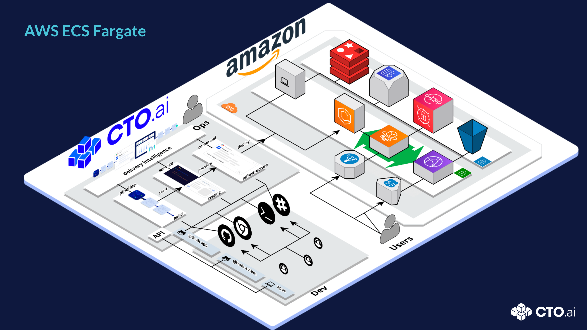

# Overview

This repo includes a complete AWS - ECS fargate Infrastructure stack that enables a PaaS workflow with GitOps / ChatOps features and supports ECS, Fargate, Aurora, SQS, Redis, and Autoscaling via CDK.

## Table of contents

- [Overview](#overview)
  - [Table of contents](#table-of-contents)
  - [Prerequisites](#prerequisites)
  - [Demo](#demo)
  - [Latest Version](#latest-version)
  - [Getting Started](#getting-started)
    - [Set Up your Account on CTO.ai](#set-up-your-account-on-ctoai)
    - [Create Secrets from Settings](#create-secrets-from-settings)
    - [Create your Sample - App](#create-your-sample---app)
  - [Usage](#usage)
    - [Build and Publish Pipelines](#build-and-publish-pipelines)
    - [Build and Publish Services](#build-and-publish-services)
    - [Trigger your Pipelines and Services](#trigger-your-pipelines-and-services)
  - [Getting help](#getting-help)
  - [Reporting bugs and Contributing](#reporting-bugs-and-contributing)
  - [Limitations](#limitations)
  - [Learn more](#learn-more)
  - [License](#license)
  - [Introduction](#introduction)
  - [Pre-requisites](#pre-requisites)
  - [Documentation](#documentation)

---

## Prerequisites

- [A local NodeJS programming environment and Workflow CLI installed on your machine](https://cto.ai/docs/install-cli)
- [An AWS Personal Access key and Secret Key, which you can create via the AWS Console](https://cto.ai/docs/aws-ecs-fargate#create-secrets-from-settings)
- [Docker](https://docs.docker.com/get-docker/), [AWS CDK](https://docs.aws.amazon.com/cdk/v2/guide/getting_started.html), and [AWS CLI](https://docs.aws.amazon.com/cli/latest/userguide/getting-started-install.html) installed on your machine.
- [NVM Installed](https://github.com/nvm-sh/nvm)

## Demo 

You can run and deploy the AWS -ECS fargate Workflow directly on our [Platform]()

## Latest Version 

The AWS - ECS Fargate Workflow is running on the latest version

## Getting Started 

### Set Up your Account on CTO.ai

Before you can deploy this Workflow, you need to [Setup your account on CTO.ai](https://cto.ai/docs/setup-flow)

### Create Secrets from Settings 

Secrets are encrypted environment variables that CTO.ai utilizes within your workflow to build and run your application and deployments. [Follow this guide to create secrets from settings.](https://cto.ai/docs/aws-ecs-fargate#create-secrets-from-settings), and also [generate your Github token](https://cto.ai/docs/aws-ecs-fargate#generate-github-token)

### Create your Sample - App

[You need to build and run your Sample-app](https://cto.ai/docs/aws-ecs-fargate#ecs---fargate-demo). Your sample App can be a Node.js HTTP server with a Dockerfile and `ops.yml` file.

## Usage 

Follow the following steps below to configure and deploy your AWS - ECS Fargate Workflow

### Build and Publish Pipelines 

- [Build Pipelines locally with the Workflow CLI](https://cto.ai/docs/aws-ecs-fargate#ecs--fargate-workflow-pipelines)

- [Run Pipelines locally with the Workflow CLI](https://cto.ai/docs/aws-ecs-fargate#run-pipelines-locally-with-the-ctoai-cli)

- [Set up your Infrastructure](https://cto.ai/docs/aws-ecs-fargate#run-and-set-up-your-infrastructure)

- [Publish Pipelines locally with CLI](https://cto.ai/docs/aws-ecs-fargate#build--publish-pipelines-locally-with-the-ctoai-cli)

### Build and Publish Services 

- [Build Services locally with the Workflow CLI](https://cto.ai/docs/aws-ecs-fargate#build-services-locally-with-the-ctoai-cli)

- [Publish Services locally with the Workflow CLI](https://cto.ai/docs/aws-ecs-fargate#publish-services-locally-with-the-ctoai-cli)

### Trigger your Pipelines and Services

When you are done building and publishing your Pipelines and Services, you can trigger them sing event triggers. 

## Getting help 

CTO.ai AWS-ECS-Fargate Kubernetes Workflow is an open source project and is supported by the community. You can buy a supported version of CTO DOKS at CTO.ai

Learn more about CTO.ai community support channels [here](https://cto.ai/community)

- Slack (chat): https://cto.ai/community

## Reporting bugs and Contributing 

Feel free to submit PRs or to fill issues. Every kind of help is appreciated.

Kindly check our [Contributing guide]() on how to propose bugfixes and improvements, and submitting pull requests to the project.

- View issues related to this image in our GitHub repository: https://github.com/workflows-sh/aws-ecs-fargate/issues

## Limitations 

## Learn more 

- Read the manual at: https://cto.ai/docs#

## License 

&copy; CTO.ai, Inc., 2022

Distributed under MIT License (`The MIT License`).

See [LICENSE](LICENSE) for more information.

---

// include in readme?

AWS ECS Fargate

## Introduction 

A PaaS like workflow for AWS ECS Fargate Infastructure as Code, powered by CTO.ai

## Pre-requisites

- Docker, Node (NVM) 12+ & npm installed
- Sign up for CTO.ai, setup CTO.ai team
- Install Ops CLI, Connect Github & Slack

## Documentation 

- [0:00](https://www.loom.com/share/b4b45f1030fb429888e2059a34ed56f0) - Intro 
- [0:37](https://www.loom.com/share/b4b45f1030fb429888e2059a34ed56f0) - Solution Overview 
- [0:55](https://www.loom.com/share/b4b45f1030fb429888e2059a34ed56f0) - Developer Control Plane 
- [1:35](https://www.loom.com/share/b4b45f1030fb429888e2059a34ed56f0) - Infrastructure Overview 
- [2:54](https://www.loom.com/share/b4b45f1030fb429888e2059a34ed56f0) - Setup Secrets, Configs 
- [5:05](https://www.loom.com/share/b4b45f1030fb429888e2059a34ed56f0) - Overview of Workflows 
- [6:34](https://www.loom.com/share/b4b45f1030fb429888e2059a34ed56f0) - Run the Setup Command 
- [11:59](https://www.loom.com/share/b4b45f1030fb429888e2059a34ed56f0) - Run a Service locally 
- [13:05](https://www.loom.com/share/b4b45f1030fb429888e2059a34ed56f0) - Run a Pipeline locally 
- [17:15](https://www.loom.com/share/b4b45f1030fb429888e2059a34ed56f0) - Mounting source to Pipeline locally 
- [18:30](https://www.loom.com/share/b4b45f1030fb429888e2059a34ed56f0) - Building & Debugging Pipelines 
- [25:00](https://www.loom.com/share/b4b45f1030fb429888e2059a34ed56f0) - Using ECR Console 
- [27:00](https://www.loom.com/share/b4b45f1030fb429888e2059a34ed56f0) - Using Cloudformation Console 
- [27:45](https://www.loom.com/share/b4b45f1030fb429888e2059a34ed56f0) - Using ECS Console 
- [29:05](https://www.loom.com/share/b4b45f1030fb429888e2059a34ed56f0) - ECS Stack Config State 
- [30:00](https://www.loom.com/share/b4b45f1030fb429888e2059a34ed56f0) - Deploying a code change 
- [31:13](https://www.loom.com/share/b4b45f1030fb429888e2059a34ed56f0) - Initialize an environment vault 
- [31:33](https://www.loom.com/share/b4b45f1030fb429888e2059a34ed56f0) - Setting enviroment vault values 
- [32:10](https://www.loom.com/share/b4b45f1030fb429888e2059a34ed56f0) - Override Container PORT 
- [33:15](https://www.loom.com/share/b4b45f1030fb429888e2059a34ed56f0) - Listing vault values 
- [33:44](https://www.loom.com/share/b4b45f1030fb429888e2059a34ed56f0) - Building a new image w/ pipelines 
- [36:04](https://www.loom.com/share/b4b45f1030fb429888e2059a34ed56f0) - Deploying a new container 
- [37:20](https://www.loom.com/share/b4b45f1030fb429888e2059a34ed56f0) - Monitoring deployment in ECS Console 
- [38:44](https://www.loom.com/share/b4b45f1030fb429888e2059a34ed56f0) - Monitoring & Searching container logs

_note: you'll have to select the timestamp, on loom.com_
