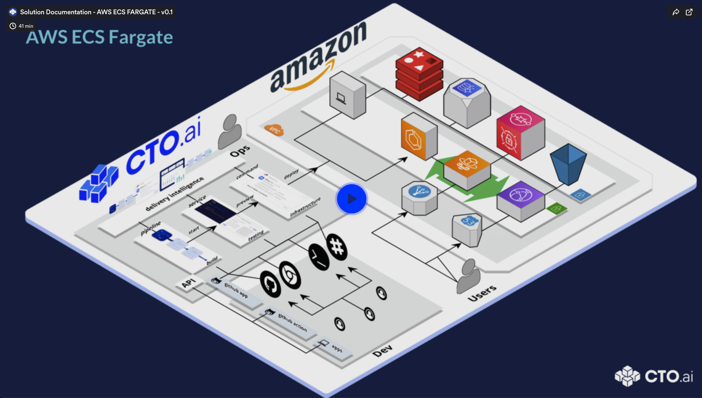

# AWS ECS Fargate

## Introduction 

A PaaS like workflow for AWS ECS Fargate Infastructure as Code, powered by CTO.ai

## Pre-requisites

- Docker, Node (NVM) 12+ & npm installed
- Sign up for CTO.ai, setup CTO.ai team
- Install Ops CLI, Connect Github & Slack

## Documentation 

- [0:00](https://www.loom.com/share/b4b45f1030fb429888e2059a34ed56f0) - Intro 
- [0:37](https://www.loom.com/share/b4b45f1030fb429888e2059a34ed56f0) - Solution Overview 
- [0:55](https://www.loom.com/share/b4b45f1030fb429888e2059a34ed56f0) - Developer Control Plane 
- [1:35](https://www.loom.com/share/b4b45f1030fb429888e2059a34ed56f0) - Infrastructure Overview 
- [2:54](https://www.loom.com/share/b4b45f1030fb429888e2059a34ed56f0) - Setup Secrets, Configs 
- [5:05](https://www.loom.com/share/b4b45f1030fb429888e2059a34ed56f0) - Overview of Workflows 
- [6:34](https://www.loom.com/share/b4b45f1030fb429888e2059a34ed56f0) - Run the Setup Command 
- [11:59](https://www.loom.com/share/b4b45f1030fb429888e2059a34ed56f0) - Run a Service locally 
- [13:05](https://www.loom.com/share/b4b45f1030fb429888e2059a34ed56f0) - Run a Pipeline locally 
- [17:15](https://www.loom.com/share/b4b45f1030fb429888e2059a34ed56f0) - Mounting source to Pipeline locally 
- [18:30](https://www.loom.com/share/b4b45f1030fb429888e2059a34ed56f0) - Building & Debugging Pipelines 
- [25:00](https://www.loom.com/share/b4b45f1030fb429888e2059a34ed56f0) - Using ECR Console 
- [27:00](https://www.loom.com/share/b4b45f1030fb429888e2059a34ed56f0) - Using Cloudformation Console 
- [27:45](https://www.loom.com/share/b4b45f1030fb429888e2059a34ed56f0) - Using ECS Console 
- [29:05](https://www.loom.com/share/b4b45f1030fb429888e2059a34ed56f0) - ECS Stack Config State 
- [30:00](https://www.loom.com/share/b4b45f1030fb429888e2059a34ed56f0) - Deploying a code change 
- [31:13](https://www.loom.com/share/b4b45f1030fb429888e2059a34ed56f0) - Initialize an environment vault 
- [31:33](https://www.loom.com/share/b4b45f1030fb429888e2059a34ed56f0) - Setting enviroment vault values 
- [32:10](https://www.loom.com/share/b4b45f1030fb429888e2059a34ed56f0) - Override Container PORT 
- [33:15](https://www.loom.com/share/b4b45f1030fb429888e2059a34ed56f0) - Listing vault values 
- [33:44](https://www.loom.com/share/b4b45f1030fb429888e2059a34ed56f0) - Building a new image w/ pipelines 
- [36:04](https://www.loom.com/share/b4b45f1030fb429888e2059a34ed56f0) - Deploying a new container 
- [37:20](https://www.loom.com/share/b4b45f1030fb429888e2059a34ed56f0) - Monitoring deployment in ECS Console 
- [38:44](https://www.loom.com/share/b4b45f1030fb429888e2059a34ed56f0) - Monitoring & Searching container logs

_note: you'll have to select the timestamp, on loom.com_

